# VinyasGen
## Generative Intelligence for Urban Regeneration
### Complete Technical & Product Blueprint (v1.0)

**Prepared for:** Project Implementation via Agentic Development (Antigravity)
**Document Type:** Master Specification — Architecture, UX, Tech Stack, Agent Design, 2D Generative Geometry Engine, Regulation Engine, Roadmap
**Region of Focus:** Delhi NCR (Delhi, Noida/Greater Noida, Gurgaon) — extensible to all Indian cities

---

## How to Use This Document

This document is written to be **self-contained**. It can be handed directly to an autonomous coding agent (such as Google Antigravity) as the single source of truth for building VinyasGen from scratch. Every section explains:

- **What** needs to be built
- **Why** it needs to be built that way
- **How** it should be built (tech stack, libraries, data formats)
- **Who** (which agent/module) is responsible for it

All diagrams are written in **Mermaid** syntax so they can be rendered directly inside Markdown viewers, GitHub, Notion, or design tools, and can also be parsed by AI agents to understand system flow.

All tools, libraries, and services referenced in this document are **free or open-source**, in line with the project's zero-cost MVP policy (detailed fully in Section 18).

---

## Table of Contents

1. Executive Summary
2. The Problem: Why Indian Urban Spaces Need VinyasGen
3. Market Context & Competitive Positioning (vs TestFit and others)
4. Brand Philosophy: What "Vinyas" Means for the Product
5. Product Vision & Guiding Principles
6. High-Level System Architecture
7. The Core User Workflow (End-to-End)
8. UX Design Philosophy — The "TestFit Experience" Adapted for India
9. The 2D Generative Geometry Engine (Core Technical Heart)
10. Vector Data Architecture (GeoJSON Standards)
11. The Regulation Engine ("Regulation-as-Data")
12. The Parking & Mobility Optimization Module
13. The Green Space & Sustainability Module
14. The Financial & Impact Feasibility Module
15. The AI Agent Ecosystem
16. The AI Copilot (Conversational Layer)
17. Frontend Architecture (Next.js + MapLibre + Deck.gl)
18. Backend Architecture (FastAPI + Shapely + PostGIS-ready design)
19. Data Model & Database Design
20. API Specification
21. Repository & Folder Structure
22. Development Roadmap (Phased Plan)
23. Testing & Quality Assurance Strategy
24. Deployment Strategy
25. Cost & Resource Policy — 100% Free Stack
26. Risks, Limitations & Disclaimers
27. Future Scope & Expansion Path
28. Appendix: Glossary, Sample JSON Schemas, Sample Code Stubs

---

# 1. Executive Summary

**VinyasGen** is a web-based, AI-assisted **urban regeneration design platform** built specifically for the Indian context — starting with the Delhi NCR region (Delhi, Noida, Greater Noida, and Gurgaon).

Where global tools like **TestFit** focus on helping large developers maximize profitability on greenfield sites in North America, VinyasGen focuses on a different but equally important problem: **how do we fix, organize, and improve the streets, lanes ("galis"), empty plots, and public spaces that already exist in Indian neighbourhoods?**

VinyasGen gives users — Resident Welfare Associations (RWAs), urban planning students, architects, civic-tech NGOs, municipal consultants, and small developers — the ability to:

1. **Select a real-world plot, street, or lane** on an interactive map.
2. **Automatically receive layout options** — multiple alternative 2D vector layouts for parking, pathways, green spaces, and built structures — generated according to local municipal regulations.
3. **Interactively edit these layouts** in real time, exactly like dragging shapes in TestFit, with the underlying geometry (areas, counts, compliance flags) recalculating live.
4. **Check compliance** against Noida/Delhi/Gurgaon bylaws automatically.
5. **Estimate impact** — parking gained, green cover increased, walkability improved, and (where relevant) financial feasibility.
6. **Generate a shareable proposal** — a clean PDF/report that a non-technical RWA member can present to their local municipal body.

The system is powered by a **2D generative geometry engine** (the computational core), a **modular "Regulation-as-Data" engine** (the legal/compliance brain), and a team of **specialized AI agents** that research regulations, optimize layouts, validate visuals, and act as a conversational copilot for the user.

The entire MVP is designed to be built using **100% free and open-source tools** — MapLibre GL JS instead of paid map APIs, Shapely/GeoPandas for geometry, FastAPI for the backend, and free-tier hosting on Vercel/Render.

This document provides the complete blueprint — architecture diagrams, data schemas, agent definitions, UX specifications, and a phased roadmap — needed to begin implementation immediately.

---

# 2. The Problem: Why Indian Urban Spaces Need VinyasGen

Indian cities — especially in the NCR — are dense, organically grown, and full of **"invisible inefficiencies"**: small pockets of unused land, streets where 40% of the width is consumed by parked vehicles, and neighbourhoods with zero usable green space within walking distance.

### 2.1 The Core Issues VinyasGen Targets

**A. Mobility & Access**
- Footpaths that are broken, encroached upon, or simply don't exist.
- "Galis" (lanes) where the *effective* usable width is far smaller than the *legal* width due to encroachments and parked vehicles.
- Poor emergency vehicle access — fire trucks and ambulances cannot pass through congested lanes.
- No structured parking, leading to chaotic, space-wasting parking patterns.

**B. Public Space & Environmental Health**
- "Dead spaces" — leftover plots, drainage margins, road corners — that become dumping grounds instead of community assets.
- Lack of pocket parks or seating areas within a 5-minute walk.
- High heat-island effect due to excessive concrete/asphalt and no greenery.
- Poor stormwater drainage due to lack of permeable surfaces.

**C. Governance & Planning**
- RWAs and local leaders *want* to improve their neighbourhoods but have no tools to **visualize, simulate, or professionally document** their proposals.
- Municipal bodies lack data-driven prioritization — they don't know which lane/plot needs intervention most urgently.
- Projects often happen in silos (road department vs water department), leading to repeated digging and wasted resources.
- Community disagreement (NIMBY-ism) stalls projects because there's no shared visual reference to build consensus around.

### 2.2 Why Existing Tools Don't Solve This

| Tool Type | What it does | Why it falls short for this problem |
|---|---|---|
| CAD software (AutoCAD, Revit) | Precise drafting | Requires expert training; not accessible to RWAs; no regulation awareness |
| Excel-based feasibility sheets | Financial modeling | No spatial/geometric intelligence; static |
| TestFit (global) | Generative feasibility for large developments | Built for greenfield, large-scale, Western zoning; not suited for micro-interventions in dense Indian lanes |
| Google Maps / basic GIS viewers | Visualization only | No generative or regulatory logic; purely observational |

**VinyasGen sits in the gap**: it is generative (like TestFit), regulation-aware (like a compliance tool), but scoped to the **micro-urban, regeneration-first** reality of Indian neighbourhoods.

---

# 3. Market Context & Competitive Positioning

### 3.1 Positioning Statement

> "VinyasGen is not 'TestFit for India.' It is the **Urban Regeneration Operating System** for Indian neighbourhoods — applying TestFit's generative, real-time design philosophy to the streets, lanes, and leftover spaces that define everyday life in Indian cities."

### 3.2 Comparative Table

| Dimension | TestFit Inc. (Global Standard) | VinyasGen |
|---|---|---|
| Primary user | Large real-estate developers | RWAs, urban planning students, civic-tech NGOs, small architects, municipal consultants |
| Primary objective | Maximize profitability of new construction | Maximize livability, compliance, and community benefit of existing/underused spaces |
| Scale of intervention | City blocks, towers, large sites | Streets, galis, pocket plots, small public spaces |
| Regulation base | Western zoning codes (IBC etc.) | Indian municipal bye-laws (DDA, GNIDA, DTCP) — modular, JSON-based |
| Core output | Massing models, unit mix, financial pro-forma | 2D vector layouts, compliance flags, livability scores, community proposal PDFs |
| Interaction model | Drag-and-drop, real-time constraint solving | Same interaction model, adapted to 2D street/plot geometry |
| Cost | Enterprise SaaS pricing | Free/open-source stack, MVP at $0 cost |

### 3.3 The "Moat"

VinyasGen's defensibility comes from three things that are hard to replicate quickly:

1. **The Regulation Database** — a structured, continuously updated JSON representation of NCR municipal bye-laws (FAR, setbacks, parking norms, TOD incentives, etc.), built and maintained partly through an AI research agent.
2. **The Micro-Geometry Engine** — generative logic tuned for irregular, small-footprint Indian plots and lanes (not the regular grid assumptions of Western tools).
3. **The Community Layer** — a proposal/voting workflow designed around how Indian RWAs and municipal bodies actually operate.

---

# 4. Brand Philosophy: What "Vinyas" Means for the Product

The name **VinyasGen** combines two ideas:

- **Vinyas** (विन्यास) — a Sanskrit term meaning *"intentional arrangement,"* *"placement,"* or *"composition."* It is used in classical Indian art, architecture, and even yoga to describe a deliberate, harmonious sequence or layout.
- **Gen** — short for *Generative*, reflecting the AI-driven, algorithmic nature of the platform's core engine.

Put together, **VinyasGen literally means "Generative Intentional Arrangement"** — which is precisely what the platform does: it takes a chaotic, unplanned space and generates a deliberate, harmonious, rule-compliant arrangement of streets, parking, greenery, and structures.

### 4.1 Brand Principles That Should Influence Design Decisions

1. **Clarity over Complexity** — Every screen should feel like "arranging," not "calculating." Numbers and compliance logic exist, but they are presented through sliders, colors, and simple icons — not raw formulas.
2. **Respect for Context** — The platform should always show the *existing* situation (the "Before") prominently, not just the proposed "After." Respecting what's already there is core to "Vinyas."
3. **Transparency** — Every regulation applied, every score calculated, should be traceable back to a source (a bylaw document, page number, or formula). This builds trust with municipal stakeholders.
4. **Accessibility** — The UI must work for a non-technical RWA member as well as a professional architect. Defaults should be sensible; advanced controls should be optional/expandable.

---

# 5. Product Vision & Guiding Principles

### 5.1 Vision Statement

> "To give every neighbourhood in India the digital tools to transform chaotic, underused spaces into organized, walkable, green, and compliant places — in minutes, not months."

### 5.2 Guiding Design Principles

- **Generative-first**: Never make the user start from a blank canvas. Always offer 3–5 AI-generated starting layouts.
- **Regulation-aware by default**: Compliance checking is not an "advanced feature" — it is baked into every generated layout from the start.
- **Vector-native**: All spatial data is stored and manipulated as vectors (GeoJSON), never as raster images, ensuring precision and easy export.
- **Modular by city**: Every regulation, every constraint, is a swappable "plugin" per city/zone — never hardcoded.
- **Free-tier-first**: Every architectural decision should default to the free/open-source option unless there's a compelling reason not to.
- **Agent-assisted, human-governed**: AI agents accelerate research, geometry generation, and QA — but a human (the user, or the project's "Architect/Manager") always reviews and approves outputs.

---

# 6. High-Level System Architecture

VinyasGen follows a **Manager-Agent, layered architecture**: a frontend that handles all visualization and interaction, a backend that handles all deterministic geometry/math/regulation logic, and an agent layer that handles research, optimization assistance, and conversational intelligence.

### 6.1 Master Architecture Diagram

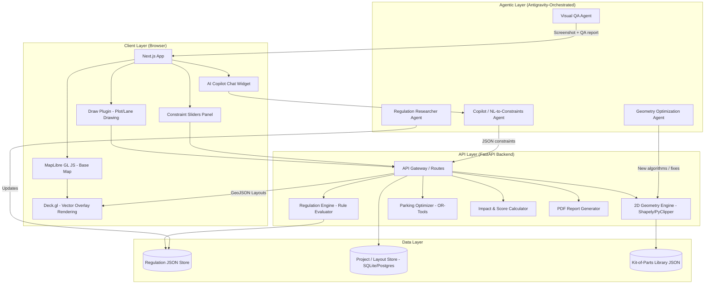

### 6.2 Explanation of Each Layer

**Client Layer (Frontend)**
- Renders the interactive map, the drawing tools, the constraint sliders, and the chat-based AI Copilot.
- Sends user actions (drawn polygons, slider values, chat messages) to the backend.
- Renders the GeoJSON layouts returned by the backend as colored vector overlays.

**API Layer (Backend)**
- The "brain" of the system. Receives geometry + constraints, applies regulation rules, runs the generative geometry engine, computes scores, and returns results — all deterministically (no AI randomness in the math).

**Data Layer**
- Stores regulation rules (per city/zone), the "Kit-of-Parts" library (benches, trees, bollards, paver patterns, parking stall templates), and saved user projects/layouts.

**Agentic Layer**
- A set of specialized AI agents that support — but do not replace — the deterministic engine. They research regulations, suggest optimizations, perform automated QA, and translate natural language into structured constraints for the Copilot.

---

# 7. The Core User Workflow (End-to-End)

This section describes, step by step, what a user actually does in VinyasGen — from opening the app to downloading a proposal.

### 7.1 End-to-End Workflow Diagram

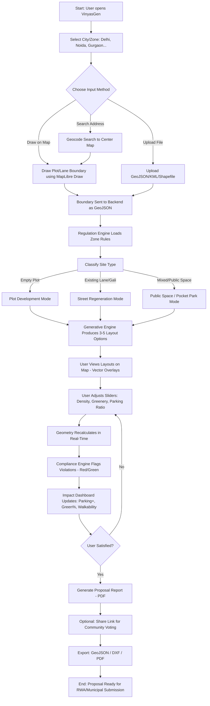

### 7.2 Narrative Walkthrough

1. **City/Zone Selection** — The user picks a city (Noida, Delhi, Gurgaon, etc.). This determines which regulation JSON file is loaded.
2. **Site Input** — The user draws a boundary directly on the map (most common case for RWAs), or uploads a survey file (GeoJSON/KML/Shapefile) if they have precise data.
3. **Site Classification** — VinyasGen automatically (or with user confirmation) classifies the site as:
   - An **empty/underused plot** (suitable for a pocket park, parking lot, or small structure),
   - An **existing lane/gali** (suitable for street regeneration — footpaths, parking reorganization, greenery), or
   - A **public space** (suitable for community amenities).
4. **Generative Layout Pass** — The 2D Geometry Engine, informed by the Regulation Engine, produces **3 to 5 alternative layouts**, each optimized for a different objective (e.g., "Max Parking," "Max Greenery," "Balanced/Community Hub").
5. **Interactive Editing** — The user views these layouts as vector overlays on the map and adjusts **sliders** (density, greenery ratio, parking allocation, pedestrian path width). The geometry **recalculates live** — this is the "TestFit moment."
6. **Compliance & Impact Feedback** — As the user edits, the system continuously re-checks compliance (highlighting violations in red) and updates an **Impact Dashboard** (parking count change, green cover %, walkability score, estimated cost).
7. **Finalization** — Once satisfied, the user generates a **Proposal Report (PDF)** — a clean, non-technical document with before/after visuals, key metrics, and regulation citations.
8. **Community Layer (Optional)** — The user can share a link for their RWA group to view and comment/vote on the proposal.
9. **Export** — Final export options: GeoJSON (for further GIS work), DXF (for architects/AutoCAD), and PDF (for submission).

---

# 8. UX Design Philosophy — The "TestFit Experience" Adapted for India

The user explicitly wants VinyasGen's interaction model to feel like **TestFit**: drag shapes, see geometry change in real time, use sliders instead of formulas, and get instant feedback. This section explains exactly how that experience is replicated and adapted.

### 8.1 What Makes TestFit's UX Work

TestFit's UX "magic" comes from three things:

1. **A persistent map/canvas** that never reloads — all changes happen as live overlay updates.
2. **A "Constraint Solver" running behind every interaction** — when you move a wall or resize a building, the software doesn't just move pixels; it recalculates unit counts, parking, FAR usage, etc., instantly.
3. **Sliders and toggles instead of text fields** — users manipulate "Density," "Height," "Parking Ratio" through draggable controls, and the geometry visually grows/shrinks in response.

### 8.2 The VinyasGen Screen Layout

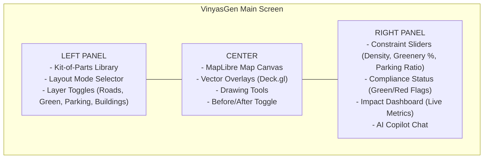

### 8.3 Core Interaction Patterns

**A. Drawing & Selecting**
- User clicks "Draw Plot" → uses `maplibre-gl-draw` to click points and form a polygon.
- On completing the polygon, it's immediately sent to the backend; within ~300ms, the buildable envelope (after setbacks) appears as a dashed inner boundary.

**B. Generative Options ("The TestFit Carousel")**
- Below the map, a horizontal carousel shows **thumbnail previews** of 3–5 generated layouts (e.g., "Max Parking," "Max Green," "Balanced").
- Clicking a thumbnail loads that layout as the active vector overlay on the main map.

**C. Real-Time Sliders**
- Sliders control high-level parameters:
  - **Density** (Low ↔ High) — affects building footprint / number of parking bays.
  - **Greenery %** (0% ↔ 40%) — affects how much of the buildable area is allocated to green/permeable surfaces.
  - **Pedestrian Priority** (Vehicle-first ↔ Pedestrian-first) — affects path widths vs. road widths.
- Moving a slider triggers a debounced API call (e.g., every 150ms after the user stops dragging) that returns updated GeoJSON; Deck.gl animates the transition between old and new geometry.

**D. Compliance Color Coding**
- Every generated polygon has a `compliance_status` property: `"valid"`, `"warning"`, or `"violation"`.
- These map to **green, yellow, and red** fill colors respectively, with a tooltip explaining *why* (e.g., "Setback violation: required 6m, current 4.2m — MPD 2041, Table 3.2").

**E. Before/After Toggle**
- A single switch at the top of the map toggles between:
  - **"Before"**: the current satellite/street view with the user's drawn boundary.
  - **"After"**: the generated/edited layout overlay.
- This toggle is critical for the "Community Dashboard" — it's the single most persuasive visual for RWAs and municipal officials.

**F. Live Impact Dashboard**
- A small panel (right side) shows numbers that update in real time as the layout changes:
  - Parking spots: `+4`
  - Green cover: `12% → 18%`
  - Walkable path length: `+22m`
  - Estimated implementation cost: `₹X,XX,XXX` (only shown if financial module is enabled)

### 8.4 Interaction Sequence Diagram

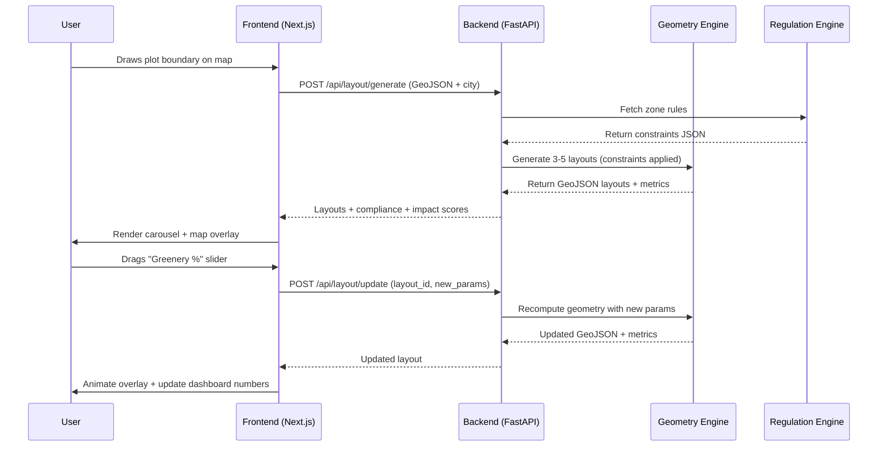

---

# 9. The 2D Generative Geometry Engine (Core Technical Heart)

This is the most important module in VinyasGen. It is **entirely 2D and vector-based** — no 3D modeling is required for the MVP. Everything is built around **polygons, lines, and points** represented as **GeoJSON**, manipulated using **Shapely** (Python) on the backend and **Turf.js** (JavaScript) for lightweight frontend calculations.

### 9.1 Engine Responsibilities

1. Take a raw plot/lane boundary (a polygon or a buffered line for streets).
2. Apply **setback offsets** to determine the buildable/usable envelope.
3. **Subdivide** that envelope into functional zones: built structures, parking bays, pathways, green areas.
4. Generate **multiple alternative layouts** based on different optimization objectives.
5. Recalculate everything **live** when the user changes a slider.
6. Output **valid GeoJSON** for every layout, annotated with compliance and metric data.

### 9.2 Core Geometric Operations

```mermaid
flowchart TD
    A[Raw Boundary - GeoJSON Polygon or LineString] --> B[Normalize: Convert to Shapely Geometry]
    B --> C[Validate: Fix self-intersections, ensure closed ring]
    C --> D{Site Type?}

    D -->|Plot| E[Apply Setback Buffer: polygon.buffer(-setback)]
    D -->|Lane/Street| F[Buffer LineString to Create Road Corridor]

    E --> G[Buildable Envelope Polygon]
    F --> H[Road Corridor Polygon]

    G --> I[Subdivision Algorithm]
    H --> J[Cross-Section Allocation: Vehicle Lane / Parking / Footpath / Green Strip]

    I --> K[Zone Polygons: Built Area, Open Space, Parking]
    J --> K

    K --> L[Tag each polygon with type + compliance status]
    L --> M[Output: GeoJSON FeatureCollection]
```

### 9.3 Key Algorithms

**A. Setback Buffering (Plot Mode)**

For a plot polygon `P` and a required setback distance `s` (in meters, converted from lat/lng using a local projection like EPSG:32643 - UTM Zone 43N for NCR):

```python
from shapely.geometry import Polygon
from shapely.ops import transform
import pyproj

# Convert to a metric projection (UTM 43N covers Delhi NCR)
project = pyproj.Transformer.from_crs("EPSG:4326", "EPSG:32643", always_xy=True).transform
plot_metric = transform(project, plot_polygon)

# Apply setback as a negative buffer
buildable_envelope = plot_metric.buffer(-setback_meters, join_style=2)  # join_style=2 = mitre (square corners)
```

**Why this matters:** Lat/lng coordinates are in degrees, not meters. All distance-based operations (setbacks, road widths, buffer zones) **must** happen in a projected coordinate system. VinyasGen standardizes on **UTM Zone 43N (EPSG:32643)** for all of NCR.

**B. Street Cross-Section Allocation (Gali/Lane Mode)**

For a lane, the input is typically a **centerline (LineString)** plus a known or estimated total width. The engine divides this width into a cross-section:

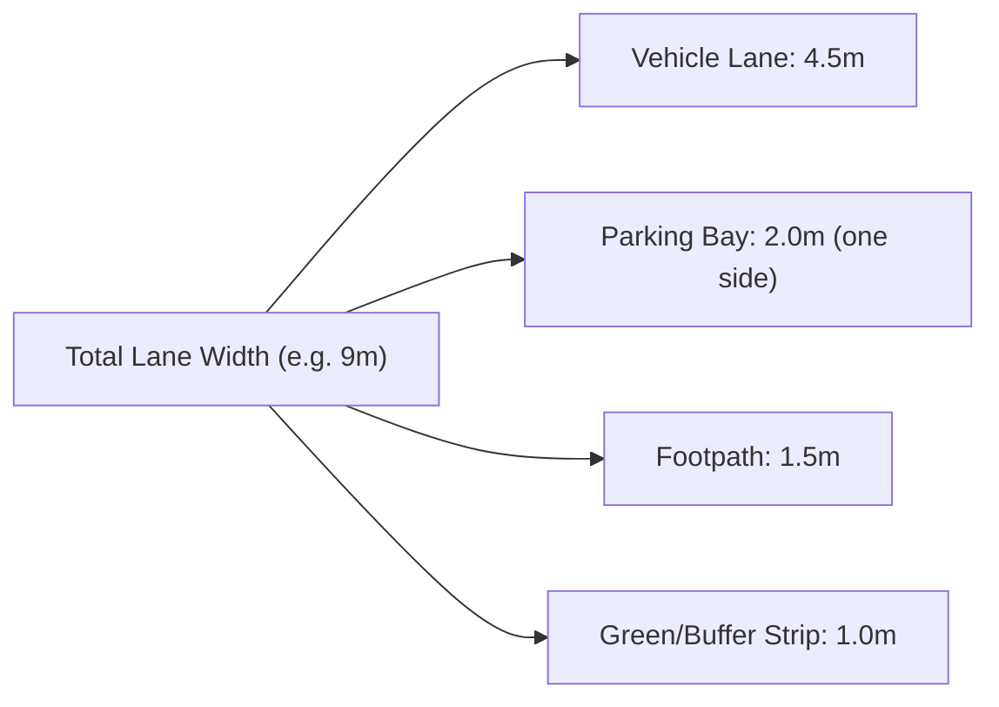

The engine creates this by:
1. Buffering the centerline by half the total width to get the full lane corridor polygon.
2. Creating parallel offset lines at calculated distances from the centerline (using `LineString.parallel_offset()` in Shapely).
3. Using these offset lines to **split** the corridor polygon into cross-sectional strips (vehicle lane, parking, footpath, green strip) using `shapely.ops.split`.

**C. Recursive Subdivision (For Building Footprints / Parking Grids)**

For empty plots where multiple smaller units (parking bays, kiosks, planter beds) need to be packed:

```python
def subdivide_grid(envelope_polygon, cell_width, cell_height, rotation_angle=0):
    """
    Generates a grid of rectangular cells within the envelope,
    rotated to align with the plot's dominant edge for natural fit.
    Cells that fall mostly outside the envelope are discarded;
    cells that partially overlap are clipped using .intersection()
    """
    # 1. Compute the minimum rotated bounding box of the envelope
    # 2. Generate a regular grid of rectangles at given cell size
    # 3. Rotate grid to match envelope's primary orientation
    # 4. For each cell: cell.intersection(envelope_polygon)
    # 5. Keep only cells with area >= (cell_width * cell_height * 0.6)
    pass
```

This is the core logic for the **"Parking Tetris"** feature — fitting the maximum number of valid parking bays (standard size ~2.5m x 5m for cars, ~1m x 2.5m for two-wheelers) into an irregular leftover plot.

**D. Boolean Operations for Zone Separation**

Once the road/parking/green zones are defined, the engine uses boolean operations to ensure **no overlaps**:

```python
remaining_area = buildable_envelope.difference(road_zone).difference(parking_zone)
green_zone = remaining_area.intersection(designated_green_region)
```

### 9.4 Generating Multiple Layout Options

The "3–5 alternative layouts" feature works by running the **same subdivision pipeline with different objective weightings**:

| Layout Option | Parking Weight | Greenery Weight | Pedestrian Weight | Typical Output |
|---|---|---|---|---|
| "Max Parking" | High | Low | Low | More parking bays, narrower footpath |
| "Max Green / Pocket Park" | Low | High | Medium | Larger green zone, planters, seating |
| "Balanced / Community Hub" | Medium | Medium | High | Mix of parking, seating, trees, wider footpath |
| "Pedestrian-First (Woonerf)" | Low | Medium | High | Shared space, traffic calming, minimal vehicle zone |
| "Fire-Safety Optimized" | Medium | Low | Low | Prioritizes minimum clear width for emergency vehicles |

Each option is generated by passing a different **weight vector** into the subdivision/allocation functions, producing distinct GeoJSON outputs that are all pre-computed and sent to the frontend carousel at once.

### 9.5 Live Recalculation Loop

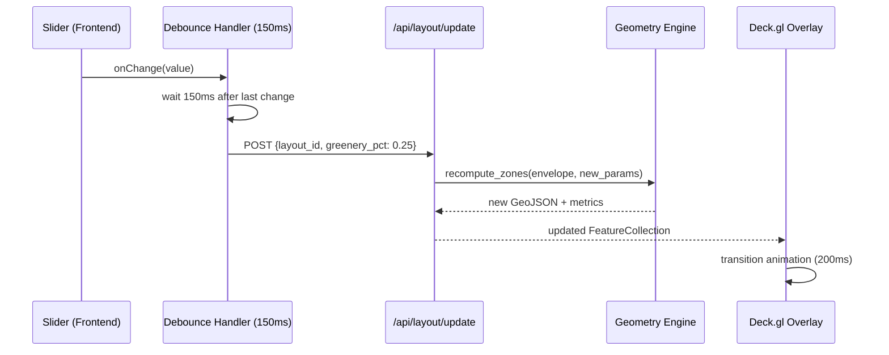

---

# 10. Vector Data Architecture (GeoJSON Standards)

All spatial data in VinyasGen — input boundaries, generated layouts, the Kit-of-Parts library, and exported proposals — is represented as **GeoJSON**. This section defines the standard schema conventions used across the entire system so that the frontend, backend, and agents all "speak the same language."

### 10.1 Why GeoJSON

- **Native to the web** — every mapping library (MapLibre, Deck.gl, Leaflet) consumes GeoJSON directly.
- **Human-readable** — easy for agents (and humans) to inspect, debug, and modify.
- **Lightweight** — even complex layouts are typically under a few hundred KB.
- **Convertible** — GeoJSON can be converted to DXF (for AutoCAD/architects) and Shapefiles easily using GeoPandas, satisfying the "export" requirement.

### 10.2 Standard Feature Schema

Every generated zone/element is a GeoJSON `Feature` with a standardized `properties` block:

```json
{
  "type": "Feature",
  "geometry": {
    "type": "Polygon",
    "coordinates": [[[77.123, 28.456], [77.124, 28.456], [77.124, 28.457], [77.123, 28.457], [77.123, 28.456]]]
  },
  "properties": {
    "feature_id": "zone_001",
    "zone_type": "parking",
    "sub_type": "two_wheeler_bay",
    "area_sqm": 12.5,
    "compliance_status": "valid",
    "compliance_notes": "Within designated parking allocation (15% of plot)",
    "editable": true,
    "layer": "layout_option_A",
    "style": {
      "fill_color": "#A8D5BA",
      "stroke_color": "#4F9D69",
      "opacity": 0.7
    }
  }
}
```

### 10.3 Top-Level Response Structure

The API always returns a structured object — not a raw `FeatureCollection` — so the frontend can separate layers, metrics, and metadata cleanly:

```json
{
  "layout_id": "layout_A_2024",
  "city": "noida",
  "zone": "sector_62_residential",
  "site_type": "empty_plot",
  "objective": "max_green",
  "geojson": {
    "type": "FeatureCollection",
    "features": [ /* zone polygons */ ]
  },
  "metrics": {
    "total_area_sqm": 450,
    "green_cover_pct": 0.32,
    "parking_count": { "car": 6, "two_wheeler": 10 },
    "walkable_path_length_m": 38,
    "ground_coverage_pct": 0.28
  },
  "compliance_summary": {
    "status": "valid",
    "violations": []
  }
}
```

### 10.4 Coordinate Reference System (CRS) Policy

- **Storage & Transport:** WGS84 (EPSG:4326) — standard lat/lng, required by GeoJSON spec and all map libraries.
- **Computation:** All distance/area-based operations (buffers, offsets, area calculations) are performed after reprojecting to **EPSG:32643 (UTM Zone 43N)**, then reprojected back to EPSG:4326 before returning to the frontend.
- This conversion is handled by a shared utility module (`geo_utils.py`) used by every backend function — ensuring consistency.

### 10.5 The "Kit-of-Parts" Vector Library

Reusable design elements (benches, trees, bollards, waste bins, paver patterns, parking stall templates) are stored as **template GeoJSON snippets** with relative coordinates, which the engine scales/places/rotates as needed:

```json
{
  "part_id": "bench_standard",
  "category": "street_furniture",
  "footprint": {
    "type": "Polygon",
    "coordinates": [[[0,0],[1.8,0],[1.8,0.6],[0,0.6],[0,0]]]
  },
  "metadata": {
    "name": "Standard RWA Bench",
    "material": "Precast Concrete",
    "estimated_cost_inr": 4500
  }
}
```

When the AI/engine places a bench, it takes this template, scales it to real-world meters (1.8m x 0.6m), rotates it to align with the nearest path edge, and translates it to the target coordinates — then appends it as a new Feature to the layout's FeatureCollection.

---

# 11. The Regulation Engine ("Regulation-as-Data")

The Regulation Engine is the **compliance brain** of VinyasGen. Its core philosophy: **regulations are data, not code.** This makes the system scalable across cities and resilient to bylaw changes — updating a JSON file is enough; no code redeployment is needed.

### 11.1 Why "Regulation-as-Data"

If regulations were hardcoded (`if city == "noida": setback = 6`), every bylaw amendment would require a code change and redeployment. Instead, VinyasGen stores all regulatory parameters in structured JSON files, one per city/zone-type combination, which the **Regulation Engine** loads and applies at runtime.

### 11.2 Regulation Schema (Master Template)

```json
{
  "city": "noida",
  "authority": "GNIDA",
  "zone_code": "residential_group_housing",
  "source_document": "Noida Building Bye-Laws 2010 (as amended)",
  "last_updated": "2026-01-15",
  "constraints": {
    "max_far": 3.5,
    "max_ground_coverage_pct": 0.35,
    "min_setback_front_m": 6.0,
    "min_setback_side_m": 4.5,
    "min_setback_rear_m": 4.5,
    "max_building_height_m": 45,
    "min_green_area_pct": 0.15,
    "parking_norms": {
      "two_wheeler_per_100sqm": 1.0,
      "four_wheeler_per_100sqm": 1.5,
      "min_aisle_width_m": 6.0
    },
    "min_road_width_for_access_m": 9.0,
    "fire_safety": {
      "min_clear_access_width_m": 4.5,
      "max_dead_end_length_m": 30
    }
  },
  "incentives": [
    {
      "name": "TOD Zone FAR Bonus",
      "condition": "within_500m_of_metro",
      "effect": { "max_far_bonus": 0.5 }
    },
    {
      "name": "Green Building Bonus",
      "condition": "igbc_certified",
      "effect": { "max_far_bonus": 0.2 }
    }
  ]
}
```

### 11.3 Regulation Lookup & Application Flow

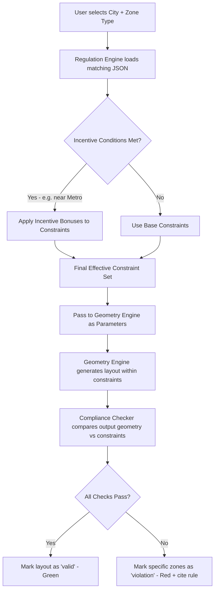

### 11.4 Compliance Checking Logic

For each generated layout, the **Compliance Checker** runs a series of deterministic checks:

```python
def check_compliance(layout_geojson, constraints):
    results = []

    # 1. Ground Coverage Check
    coverage = built_area / plot_area
    if coverage > constraints["max_ground_coverage_pct"]:
        results.append({
            "check": "ground_coverage",
            "status": "violation",
            "detail": f"Coverage {coverage:.2%} exceeds limit {constraints['max_ground_coverage_pct']:.2%}",
            "source": "Noida Building Bye-Laws 2010, Table 4.1"
        })

    # 2. Setback Check (geometric intersection test)
    setback_zone = plot_polygon.buffer(-constraints["min_setback_front_m"])
    if not building_footprint.within(setback_zone):
        results.append({"check": "setback", "status": "violation", ...})

    # 3. Parking Adequacy Check
    required_parking = (built_area / 100) * constraints["parking_norms"]["four_wheeler_per_100sqm"]
    if provided_parking_count < required_parking:
        results.append({"check": "parking", "status": "warning", ...})

    # 4. Fire Access Check
    if min_clear_path_width < constraints["fire_safety"]["min_clear_access_width_m"]:
        results.append({"check": "fire_access", "status": "violation", ...})

    return results
```

### 11.5 City Modules for NCR (Initial Scope)

| City/Authority | Code | Key Regulatory Document | Initial Focus |
|---|---|---|---|
| Noida / Greater Noida | GNIDA | Noida Building Bye-Laws | Group Housing, Sector-based residential streets |
| Delhi | DDA / MCD | Master Plan Delhi 2041, Unified Building Bye-Laws | Residential colonies, "gali" lanes |
| Gurgaon | DTCP Haryana | Haryana Building Code | Private colonies, group housing roads |

Each is a separate JSON file under `/data/regulations/{city}/{zone_code}.json`. The **Regulation Researcher Agent** (Section 15) is responsible for populating and updating these files.

### 11.6 Important Disclaimer (Built Into the Product)

Every report and UI screen that displays compliance results must include this disclaimer, verbatim or close to it:

> "VinyasGen is a decision-support and visualization tool. Compliance results are indicative, based on digitized regulatory data, and do not constitute statutory approval. All proposals must be verified with the relevant municipal authority before implementation."

This is a **non-negotiable legal safeguard** and should be implemented as a persistent footer/banner component.

---

# 12. The Parking & Mobility Optimization Module

Parking is one of the highest-impact, most visible problems in Indian neighbourhoods, so VinyasGen treats it as a dedicated module rather than just "another zone type."

### 12.1 Module Responsibilities

1. Given an available area (a leftover plot, a widened road shoulder, or a redesigned lane cross-section), determine the **maximum number of valid parking bays** that fit, for a given mix of vehicle types.
2. Ensure **circulation aisles** (minimum width for cars to maneuver — typically 6m for a two-way aisle) are preserved.
3. Flag if the resulting layout **blocks emergency access** (fire truck turning radius / minimum clear width).
4. Output a "Parking Efficiency Score" — `(usable parking area) / (total allocated area)`.

### 12.2 Parking Optimization Flow

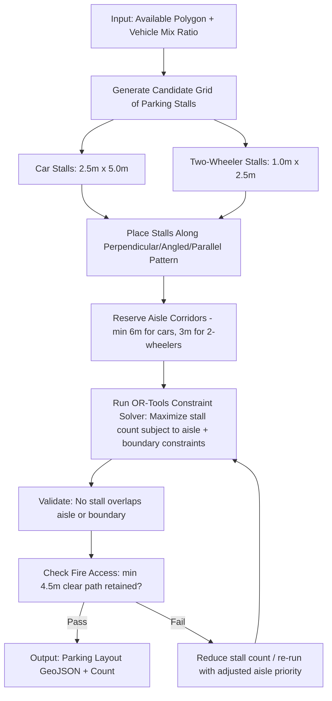

### 12.3 Why Google OR-Tools

For the "Parking Tetris" problem — fitting the maximum number of rectangular stalls into an irregular polygon while respecting aisle constraints — this is a **combinatorial optimization / packing problem**. Google OR-Tools' **CP-SAT solver** is well-suited because:

- It handles **discrete decisions** (place stall at position X or not) with constraints (no overlaps, aisle access).
- It's **free, open-source**, and has a Python API that integrates directly with the FastAPI backend.
- It can optimize for multiple objectives (maximize count vs. maximize efficiency) by adjusting the objective function.

A simplified formulation:

```python
from ortools.sat.python import cp_model

model = cp_model.CpModel()
# For each candidate stall position (from a pre-generated grid):
#   create a boolean variable: place_stall[i] ∈ {0, 1}
# Constraints:
#   - sum of overlapping stalls at any grid cell <= 1
#   - reserved aisle cells cannot have place_stall == 1
# Objective:
#   maximize sum(place_stall[i] * stall_value[i])
#   where stall_value can weight cars higher than two-wheelers if needed

solver = cp_model.CpSolver()
status = solver.Solve(model)
```

### 12.4 Traffic Flow & Bottleneck Visualization (Lightweight)

For the MVP, full agent-based traffic simulation is **out of scope** (flagged as Future Scope in Section 27). Instead, VinyasGen implements a **lightweight "effective width" analysis**:

1. From the lane's drawn boundary, subtract all "obstruction" zones (parked vehicles, encroachments — either user-marked or detected via the optional CV module).
2. Calculate the **minimum effective width** along the lane's centerline.
3. Compare this against the `fire_safety.min_clear_access_width_m` regulation value.
4. Render a simple **heatmap line** along the centerline — green where width is adequate, red where it's below the minimum.

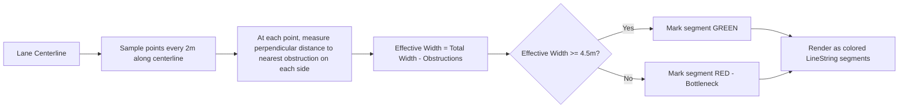

---

# 13. The Green Space & Sustainability Module

### 13.1 Module Responsibilities

1. Identify "Dead Space" within a plot/lane that can be converted to green/permeable surfaces.
2. Allocate green zones based on the `min_green_area_pct` regulation and the user's "Greenery %" slider.
3. Place **Kit-of-Parts** green elements: trees, planters, bioswales (for stormwater), permeable paving.
4. Calculate simple **sustainability metrics**.

### 13.2 Green Space Allocation Flow

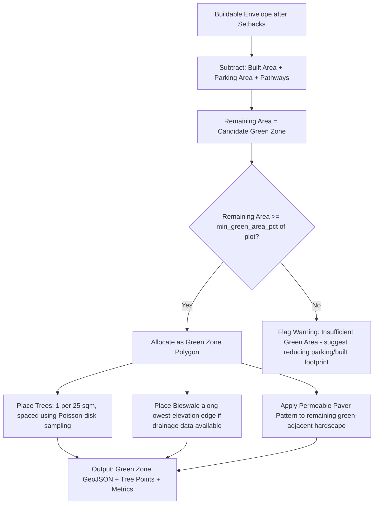

### 13.3 Sustainability Metrics Calculated

| Metric | Formula (Simplified) | Purpose |
|---|---|---|
| Green Cover % | `green_area / total_plot_area` | Compliance + livability score |
| Permeable Surface % | `(green_area + permeable_paving_area) / total_plot_area` | Stormwater/heat indicator |
| Estimated Tree Count | `green_area / 25 sqm` (1 tree per 25 sqm, adjustable) | Carbon/shade estimate |
| Heat Mitigation Index | Simple weighted score: `0.5*green% + 0.3*permeable% + 0.2*(1 - hardscape%)` | Relative "before vs after" comparison |

> **Note:** These are simplified, indicative formulas suitable for an MVP/decision-support tool — not scientific environmental modeling. This should be stated clearly in any generated report.

### 13.4 Tree Placement Algorithm (Poisson-Disk Sampling)

To avoid an artificial "grid of trees" look, VinyasGen uses **Poisson-disk sampling** — points are placed randomly but with a minimum distance constraint, producing a natural, organic distribution (similar to how trees are spaced in real streetscapes):

```python
def place_trees(green_polygon, min_spacing_m=4.0):
    """
    1. Generate candidate points randomly within the bounding box of green_polygon
    2. For each candidate, check it's inside green_polygon AND
       at least min_spacing_m away from all previously accepted points
    3. Accept if both conditions met; repeat until no more points fit
    4. Return list of accepted Point geometries
    """
    pass
```

---

# 14. The Financial & Impact Feasibility Module

While VinyasGen's primary focus is livability and regeneration (not profit-maximization like TestFit), many proposals — especially for empty plots that could include small commercial kiosks, paid parking, or community centers — benefit from a **lightweight feasibility estimate**.

### 14.1 Module Responsibilities

1. Estimate **implementation cost** of a proposed layout based on per-unit costs of elements (paving, benches, trees, parking demarcation, signage).
2. Estimate **potential revenue** (if applicable) — e.g., paid parking, small kiosk rental.
3. Present results as a simple **range** (Low / Expected / High) rather than false-precision single numbers.

### 14.2 Cost Estimation Flow

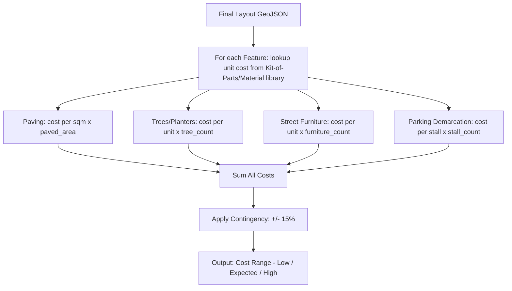

### 14.3 Sample Cost Reference Table (Stored as JSON, Editable)

```json
{
  "currency": "INR",
  "items": {
    "interlocking_paver_sqm": { "low": 450, "expected": 600, "high": 850 },
    "tree_sapling_with_guard": { "low": 800, "expected": 1200, "high": 2000 },
    "rwa_bench": { "low": 3500, "expected": 4500, "high": 6500 },
    "bollard": { "low": 600, "expected": 900, "high": 1400 },
    "parking_stall_marking": { "low": 200, "expected": 350, "high": 600 },
    "bioswale_per_sqm": { "low": 700, "expected": 1100, "high": 1800 }
  }
}
```

### 14.4 Impact Metrics for the "Community Dashboard"

These are the headline numbers shown to RWAs and municipal stakeholders — designed to be understandable without any technical background:

| Metric | Example Display |
|---|---|
| Parking Capacity Change | "+8 car spots, +14 two-wheeler spots" |
| Green Cover Change | "12% → 24% (+12 percentage points)" |
| New Walkable Path | "+35 meters of footpath added" |
| Trees Added | "+9 new trees" |
| Estimated Cost | "₹3.2L – ₹4.8L (indicative)" |
| Compliance Status | "✅ Fully compliant with Noida Bye-Laws" or "⚠️ 1 item needs review" |

---

# 15. The AI Agent Ecosystem

VinyasGen uses a **team of specialized AI agents**, orchestrated through Antigravity, each with a narrow, well-defined responsibility. This section defines each agent's role, inputs, outputs, and guardrails.

### 15.1 Agent Overview Diagram

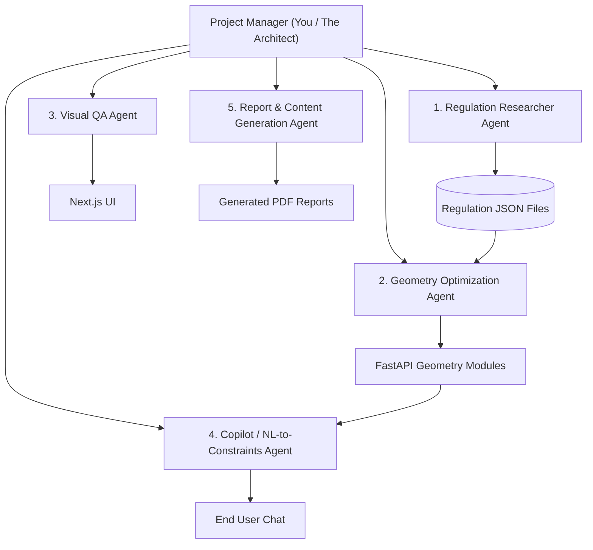

### 15.2 Agent 1 — Regulation Researcher Agent

**Purpose:** Convert unstructured municipal bylaw documents (PDFs) into the structured Regulation JSON schema (Section 11.2).

**Inputs:** A PDF or text extract of a municipal bylaw document (e.g., Noida Building Bye-Laws).

**Process:**
1. Parse the document (text extraction).
2. Identify sections relevant to: FAR/FSI, ground coverage, setbacks, height limits, parking norms, green area requirements, fire safety clearances.
3. Extract numeric values and map them to the standard JSON schema fields.
4. **Always record the source** — document name, page/table/section number — for every extracted value.
5. Output a **draft JSON file** + a human-readable summary of what was extracted and from where.

**Output:** A draft regulation JSON file placed in a `/pending_review/` folder — **never directly into the live `/data/regulations/` folder**.

**Guardrail:** A human (the project owner) must review and move the file from `/pending_review/` to `/data/regulations/` before it becomes "live." This is the **Human-in-the-Loop checkpoint** described earlier.

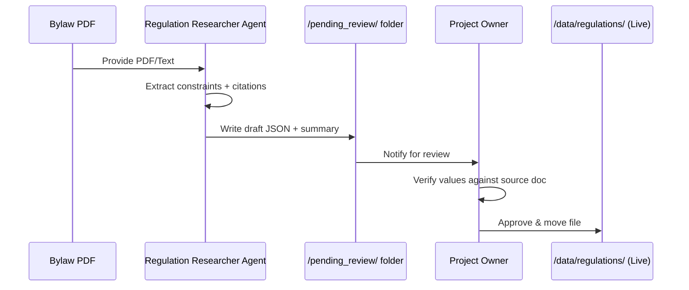

### 15.3 Agent 2 — Geometry Optimization Agent

**Purpose:** Write, test, and refine the Python geometry functions (Shapely/OR-Tools logic) described in Sections 9 and 12.

**Inputs:** Functional specifications (e.g., "Write a function that subdivides a polygon into a parking grid given stall dimensions and aisle width").

**Process:**
1. Implement the function in `backend/engine/`.
2. Write **unit tests** using sample polygons (square plot, L-shaped plot, narrow lane).
3. Run tests; if a test fails (e.g., overlapping stalls), debug and re-test automatically.
4. Document the function with docstrings explaining assumptions (units, CRS, edge cases).

**Output:** Tested, documented Python modules + a test report.

**Guardrail:** All geometry functions must include **unit tests with at least 3 sample shapes** (regular square, irregular polygon, very narrow/long polygon) before being considered complete.

### 15.4 Agent 3 — Visual QA Agent

**Purpose:** Automatically verify that generated layouts render correctly on the map — no overlapping polygons, no rendering outside the plot boundary, correct color coding for compliance status.

**Inputs:** A running instance of the frontend (local dev server) + a set of test plot geometries.

**Process:**
1. Open the app in a browser (using Antigravity's Browser Agent capability).
2. Draw/load each test plot.
3. Trigger layout generation and slider adjustments.
4. Capture screenshots at each step.
5. Programmatically check: do generated polygons stay within the plot boundary? Do colors match `compliance_status` values? Does the impact dashboard update?

**Output:** A QA report with screenshots and pass/fail status for each check.

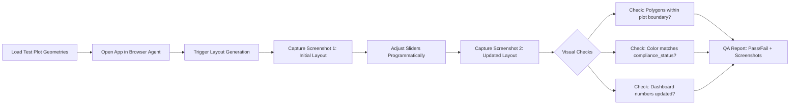

### 15.5 Agent 4 — Copilot / NL-to-Constraints Agent

**Purpose:** Power the in-app **AI Copilot** chat — translate natural language requests into structured constraint adjustments, **without performing any geometry math itself**.

**The Golden Rule (from earlier discussion):** *"The Agent is for Research/Translation, the Engine is for Math."* The LLM never calculates areas or generates coordinates directly — it only produces a structured JSON of constraint changes, which is then passed to the deterministic Geometry Engine.

**Example Interaction:**

> **User:** "I want more parking but keep at least one tree near the entrance."

**Agent Output (JSON, sent to backend):**
```json
{
  "intent": "modify_layout",
  "constraint_updates": {
    "parking_weight": "increase",
    "preserve_elements": [
      { "type": "tree", "location_hint": "near_entrance", "min_count": 1 }
    ]
  },
  "explanation": "Increasing parking allocation while protecting at least one tree near the entrance zone."
}
```

The backend's Geometry Engine receives this JSON, adjusts its weight parameters accordingly, re-runs the subdivision algorithm with a constraint to preserve a tree-point near the entrance, and returns updated GeoJSON — which the Copilot then describes back to the user in plain language.

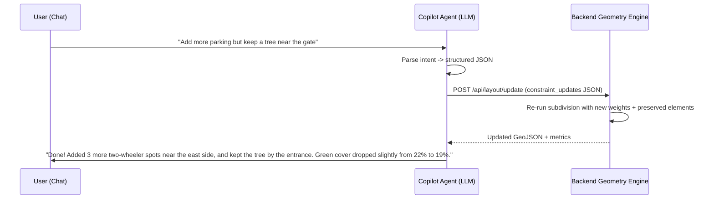

### 15.6 Agent 5 — Report & Content Generation Agent

**Purpose:** Generate the human-readable **Proposal Report (PDF)** content — descriptive text, summaries, and recommendations — based on the final layout's metrics and compliance results.

**Inputs:** Final layout GeoJSON + metrics + compliance summary.

**Process:**
1. Generate a plain-language **summary paragraph** (e.g., "This proposal converts an underused 450 sqm plot into a community space with 16 organized parking bays, a small pocket park with 9 trees, and a continuous footpath connecting to the main road...").
2. Generate **section headers and descriptions** for the PDF (Site Overview, Proposed Changes, Compliance Summary, Estimated Impact, Cost Estimate, Disclaimer).
3. Pass this content + the layout images/maps to the PDF generation library (e.g., using the `pdf` skill / ReportLab / WeasyPrint).

**Guardrail:** All factual claims (areas, counts, compliance citations) must come from the **metrics/compliance JSON**, never invented by the agent. The agent's job is *phrasing*, not *calculating*.

### 15.7 Agent Coordination Summary Table

| Agent | Primary Tooling | Output Location | Human Checkpoint Required? |
|---|---|---|---|
| Regulation Researcher | PDF parsing + LLM extraction | `/pending_review/*.json` | Yes — before going live |
| Geometry Optimization | Python, Shapely, OR-Tools, pytest | `/backend/engine/*.py` | Code review recommended |
| Visual QA | Browser automation | QA report (markdown/screenshots) | Review failed checks |
| Copilot | LLM (structured output only) | Runtime API calls | No (deterministic engine guards output) |
| Report & Content | LLM + PDF library | `/exports/*.pdf` | Spot-check recommended |

---

# 16. The AI Copilot (Conversational Layer)

### 16.1 Purpose

The Copilot is the **friendly face** of VinyasGen — a chat widget (right panel, see Section 8.2) that lets users interact in plain language instead of fiddling with every slider.

### 16.2 Capabilities

- **Explain regulations**: "Why can't I build closer to the boundary here?" → Copilot retrieves the relevant constraint + citation from the Regulation Engine and explains it conversationally.
- **Suggest layout changes**: "How can I fit more parking?" → Copilot translates this into constraint adjustments (Section 15.5) and triggers a re-generation.
- **Explain metrics**: "What does 'walkability score' mean here?" → Copilot explains the formula and what the current value implies.
- **Generate summaries**: "Summarize this proposal for my RWA group" → Copilot produces a short, shareable text summary (this can reuse the Report & Content Agent's logic).

### 16.3 Architecture Pattern: "LLM as Orchestrator, Not Calculator"

This is the most important architectural rule for the Copilot, repeated here because it's critical:

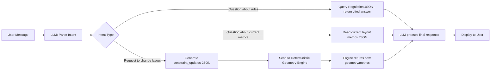

The LLM **never** outputs raw coordinates, areas, or counts as "final answers" — it only retrieves or triggers calculations from the deterministic engine, then phrases the result.

### 16.4 Free-Tier Implementation Note

For the MVP, the Copilot can use:
- A **free-tier LLM API** (e.g., Google Gemini API free tier, or other providers with generous free quotas — verify current limits before committing), OR
- A **locally-run open-source model** (e.g., via Ollama) if API costs become a concern at scale.

The Copilot's prompt should always include the **current layout's metrics JSON and the active regulation JSON** as context, so its responses are grounded in real data rather than general knowledge.

---

# 17. Frontend Architecture (Next.js + MapLibre + Deck.gl)

### 17.1 Technology Choices & Rationale

| Technology | Role | Why This Choice |
|---|---|---|
| **Next.js** | App framework | Industry-standard React framework; great for SSR/SSG of report pages and SPA-like map interactions; large ecosystem |
| **TypeScript** | Type safety | Catches errors in GeoJSON property handling early; essential when many components share complex data shapes |
| **Tailwind CSS** | Styling | Rapid UI development with consistent design tokens; matches the "clean, whitespace-heavy" Vinyas brand aesthetic |
| **MapLibre GL JS** | Base map rendering | **Free, open-source fork of Mapbox GL JS** — same API, same performance, zero cost, no usage caps |
| **react-map-gl** | React wrapper for MapLibre | Declarative React integration; handles map lifecycle cleanly |
| **@maplibre/maplibre-gl-draw** | Drawing tool | Lets users draw/edit polygons (plots, lanes) directly on the map |
| **Deck.gl** | Vector overlay rendering | High-performance WebGL rendering of GeoJSON layers (PolygonLayer, GeoJsonLayer); handles real-time updates smoothly |
| **Turf.js** | Lightweight frontend geometry | Quick client-side calculations (e.g., live area preview while drawing) before sending to backend |
| **Zustand** | State management | Lightweight (vs Redux); ideal for managing map state, active layout, slider values, and layer visibility |
| **react-pdf / pdf libraries** | Report preview | Preview generated PDF reports within the app |

### 17.2 Frontend Component Architecture

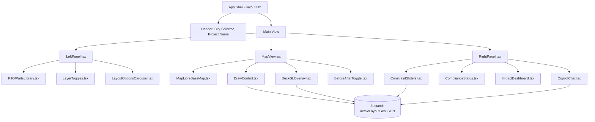

### 17.3 State Management Shape (Zustand Store)

```typescript
interface VinyasGenState {
  city: string;
  zoneCode: string;
  plotBoundary: GeoJSON.Feature | null;
  siteType: 'empty_plot' | 'lane' | 'public_space' | null;

  layoutOptions: LayoutResponse[];   // 3-5 generated options
  activeLayoutId: string | null;

  sliderValues: {
    densityLevel: number;       // 0-1
    greeneryPct: number;        // 0-0.4
    pedestrianPriority: number; // 0-1
  };

  complianceResults: ComplianceCheck[];
  impactMetrics: ImpactMetrics;

  beforeAfterMode: 'before' | 'after';

  // Actions
  setPlotBoundary: (geojson: GeoJSON.Feature) => void;
  generateLayouts: () => Promise<void>;
  updateSlider: (key: string, value: number) => void;
  selectLayoutOption: (id: string) => void;
}
```

### 17.4 Real-Time Update Pattern (Frontend)

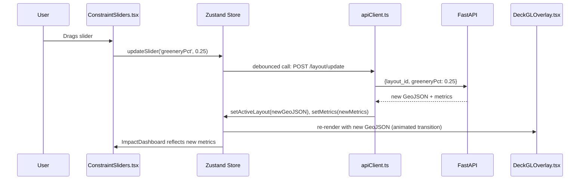

### 17.5 Map Styling Approach

To keep costs at zero while maintaining a professional look:

- Use **MapLibre GL JS** with free vector tile sources such as **OpenStreetMap-based styles** via providers offering generous free tiers (e.g., free vector tile styles compatible with MapLibre).
- Create a **custom minimal style** (light grey basemap, muted roads) so that the bright, color-coded VinyasGen overlays (parking = blue, green zones = green, violations = red) stand out clearly — this is core to the "Vinyas" clean aesthetic described in Section 4.1.

---

# 18. Backend Architecture (FastAPI + Shapely + PostGIS-Ready Design)

### 18.1 Technology Choices & Rationale

| Technology | Role | Why This Choice |
|---|---|---|
| **Python** | Core language | Best ecosystem for geospatial computation (Shapely, GeoPandas, PyProj, OR-Tools) |
| **FastAPI** | Web framework | Async, fast, automatic OpenAPI docs (useful for the agent ecosystem to understand available endpoints), easy to deploy free on Render/Railway |
| **Shapely** | 2D geometry operations | Industry-standard for polygon/line operations: buffer, intersection, union, difference |
| **PyProj** | Coordinate transformations | Converts between WGS84 (lat/lng) and UTM 43N (meters) for accurate distance calculations |
| **GeoPandas** | Tabular + spatial data handling | Useful for batch operations, reading/writing Shapefiles/GeoJSON, and DXF export pipelines |
| **PyClipper** | Polygon offsetting | Robust handling of complex setback/offset operations, especially for non-convex polygons |
| **Google OR-Tools** | Combinatorial optimization | Parking layout packing problem (Section 12.3) |
| **SQLite (MVP) → PostgreSQL+PostGIS (Scale)** | Data storage | SQLite for zero-cost MVP; clean upgrade path to PostGIS for spatial indexing at scale |
| **Pydantic** | Data validation | Ensures all GeoJSON payloads and regulation schemas are validated before processing |

### 18.2 Backend Module Structure

```mermaid
graph TD
    Main[main.py - FastAPI app] --> Routes[API Routes]

    Routes --> LayoutRoutes[/api/layout/* routes]
    Routes --> RegRoutes[/api/regulations/* routes]
    Routes --> ReportRoutes[/api/report/* routes]
    Routes --> CopilotRoutes[/api/copilot/* routes]

    LayoutRoutes --> GeomEngine[engine/geometry_engine.py]
    LayoutRoutes --> ParkingEngine[engine/parking_optimizer.py]
    LayoutRoutes --> GreenEngine[engine/green_space.py]

    GeomEngine --> GeoUtils[engine/geo_utils.py - CRS conversions]
    ParkingEngine --> GeoUtils
    GreenEngine --> GeoUtils

    RegRoutes --> RegLoader[engine/regulation_loader.py]
    RegLoader --> RegFiles[(data/regulations/*.json)]

    LayoutRoutes --> ComplianceChecker[engine/compliance_checker.py]
    ComplianceChecker --> RegLoader

    ReportRoutes --> ReportGen[engine/report_generator.py]
    ReportGen --> ContentAgentAPI[Agent: Report Content]

    CopilotRoutes --> CopilotAgentAPI[Agent: Copilot]
    CopilotAgentAPI --> LayoutRoutes
```

### 18.3 Core Geometry Engine Module Breakdown

```
backend/engine/
├── geo_utils.py            # CRS conversions (WGS84 <-> UTM43N), validation helpers
├── geometry_engine.py       # Setback buffering, subdivision, zone allocation
├── parking_optimizer.py     # OR-Tools based stall packing
├── green_space.py           # Green zone allocation, tree placement (Poisson-disk)
├── compliance_checker.py    # Runs all regulation checks, returns violations
├── regulation_loader.py     # Loads & merges base + incentive regulation JSON
├── scoring.py                # Impact metrics (walkability, green%, etc.)
└── report_generator.py       # Assembles PDF using ReportLab/WeasyPrint
```

### 18.4 Request Lifecycle (Full Generation Request)

```mermaid
sequenceDiagram
    participant FE as Frontend
    participant API as FastAPI /api/layout/generate
    participant Val as Pydantic Validator
    participant Reg as regulation_loader
    participant Geo as geometry_engine
    participant Park as parking_optimizer
    participant Green as green_space
    participant Comp as compliance_checker
    participant Score as scoring

    FE->>API: POST {plot_geojson, city, zone_code, site_type}
    API->>Val: Validate request schema
    Val-->>API: OK
    API->>Reg: load_regulations(city, zone_code)
    Reg-->>API: constraints JSON (with incentives applied)
    API->>Geo: generate_envelope(plot_geojson, constraints)
    Geo-->>API: buildable_envelope (Shapely geometry)

    loop For each of 3-5 objective profiles
        API->>Geo: subdivide(envelope, weights[i])
        Geo-->>API: zone_polygons
        API->>Park: optimize_parking(parking_zone, vehicle_mix)
        Park-->>API: parking_layout
        API->>Green: allocate_green(green_zone)
        Green-->>API: green_layout + tree_points
        API->>Comp: check_compliance(all_zones, constraints)
        Comp-->>API: compliance_results
        API->>Score: compute_metrics(all_zones)
        Score-->>API: impact_metrics
    end

    API-->>FE: [layout_A, layout_B, ... layout_E] (each with geojson + metrics + compliance)
```

### 18.5 Error Handling & Edge Cases

The backend must gracefully handle:

- **Degenerate polygons**: self-intersecting or zero-area inputs → return a clear validation error to the frontend, prompting the user to redraw.
- **Setback exceeds plot size**: if `buffer(-setback)` results in an empty geometry, return a specific message: "This plot is too small for the minimum setback requirements under [regulation]. Consider a variance request or a smaller intervention."
- **Disconnected results**: if subdivision produces a `MultiPolygon` where a single `Polygon` was expected for a "building" zone, the engine should select the largest contiguous piece and flag the rest as "unused fragments" for green/path allocation instead of discarding them.

---

# 19. Data Model & Database Design

### 19.1 MVP Database Choice: SQLite

For the MVP, **SQLite** is sufficient — it's a zero-cost, zero-configuration, file-based database that's perfect for a single-instance deployment on Render's free tier. The schema is designed so that migrating to **PostgreSQL + PostGIS** later requires minimal changes (mainly swapping geometry columns from TEXT/JSON to native `geometry` types).

### 19.2 Entity-Relationship Diagram

```mermaid
erDiagram
    PROJECT ||--o{ LAYOUT_OPTION : has
    PROJECT {
        string project_id PK
        string user_id
        string city
        string zone_code
        string site_type
        text plot_geojson
        datetime created_at
    }

    LAYOUT_OPTION ||--o{ COMPLIANCE_RESULT : has
    LAYOUT_OPTION {
        string layout_id PK
        string project_id FK
        string objective_profile
        text geojson
        text metrics_json
        float greenery_pct
        float density_level
        float pedestrian_priority
        datetime created_at
    }

    COMPLIANCE_RESULT {
        string result_id PK
        string layout_id FK
        string check_name
        string status
        text detail
        string source_citation
    }

    REGULATION_FILE {
        string reg_id PK
        string city
        string zone_code
        text constraints_json
        string source_document
        date last_updated
        string review_status
    }

    PROPOSAL_REPORT ||--|| LAYOUT_OPTION : generated_from
    PROPOSAL_REPORT {
        string report_id PK
        string layout_id FK
        text content_summary
        string pdf_path
        datetime generated_at
    }

    COMMUNITY_VOTE {
        string vote_id PK
        string report_id FK
        string voter_session_id
        string vote_type
        text comment
        datetime created_at
    }

    PROJECT ||--o{ PROPOSAL_REPORT : (via layout)
    PROPOSAL_REPORT ||--o{ COMMUNITY_VOTE : receives
```

### 19.3 Table Notes

- **`plot_geojson` and `geojson`** are stored as TEXT (serialized JSON) in SQLite for the MVP. In a PostGIS upgrade, these become native `geometry(Polygon, 4326)` columns with spatial indexes.
- **`REGULATION_FILE.review_status`** tracks the Human-in-the-Loop workflow described in Section 15.2: `"pending_review"`, `"approved"`, `"deprecated"`.
- **`COMMUNITY_VOTE.voter_session_id`** is an anonymous session identifier (no login required for community voting) — keeps the MVP simple while still gathering structured feedback.

---

# 20. API Specification

This section defines the core API endpoints. All endpoints are prefixed with `/api`. Request/response bodies use the schemas defined in Sections 10 and 11.

### 20.1 Endpoint Summary Table

| Method | Endpoint | Purpose |
|---|---|---|
| `POST` | `/api/layout/generate` | Submit a plot/lane boundary + city/zone; receive 3-5 generated layout options |
| `POST` | `/api/layout/update` | Update an existing layout with new slider values or constraint adjustments |
| `GET` | `/api/layout/{layout_id}` | Retrieve a saved layout |
| `GET` | `/api/regulations/{city}/{zone_code}` | Retrieve the effective (base + incentives) regulation set |
| `POST` | `/api/regulations/check-incentives` | Check which incentives apply given a location (e.g., proximity to Metro) |
| `POST` | `/api/report/generate` | Generate a PDF proposal report from a finalized layout |
| `GET` | `/api/report/{report_id}` | Download/view a generated report |
| `POST` | `/api/community/vote` | Submit a vote/comment on a shared proposal |
| `GET` | `/api/community/{report_id}/votes` | Retrieve aggregated votes/comments |
| `POST` | `/api/copilot/message` | Send a chat message to the AI Copilot |
| `POST` | `/api/export/dxf` | Export a layout as a DXF file |

### 20.2 Key Endpoint: `POST /api/layout/generate`

**Request:**
```json
{
  "plot_geojson": { "type": "Feature", "geometry": { "type": "Polygon", "coordinates": [[...]] } },
  "city": "noida",
  "zone_code": "residential_group_housing",
  "site_type": "empty_plot",
  "context": {
    "near_metro": true,
    "near_metro_distance_m": 320
  }
}
```

**Response:**
```json
{
  "project_id": "proj_abc123",
  "layout_options": [
    {
      "layout_id": "layout_A",
      "objective_profile": "max_parking",
      "geojson": { "type": "FeatureCollection", "features": [ /* ... */ ] },
      "metrics": { "...": "..." },
      "compliance_summary": { "status": "valid", "violations": [] }
    },
    {
      "layout_id": "layout_B",
      "objective_profile": "max_green",
      "geojson": { "...": "..." },
      "metrics": { "...": "..." },
      "compliance_summary": { "status": "warning", "violations": [ {"check": "parking", "status": "warning", "detail": "..." } ] }
    }
  ]
}
```

### 20.3 Key Endpoint: `POST /api/layout/update`

**Request:**
```json
{
  "layout_id": "layout_A",
  "slider_values": {
    "density_level": 0.6,
    "greenery_pct": 0.25,
    "pedestrian_priority": 0.4
  },
  "preserve_elements": [
    { "type": "tree", "feature_id": "tree_003" }
  ]
}
```

**Response:** Same shape as a single `layout_option` object above, with updated `geojson`, `metrics`, and `compliance_summary`.

### 20.4 Key Endpoint: `POST /api/copilot/message`

**Request:**
```json
{
  "project_id": "proj_abc123",
  "active_layout_id": "layout_A",
  "message": "Can I add a small kiosk near the entrance?"
}
```

**Response:**
```json
{
  "reply_text": "A small kiosk (around 9 sqm) could fit near the entrance, but it would reduce the green zone from 22% to 18%, which is still above the 15% minimum required by Noida bye-laws. Would you like me to add it?",
  "suggested_action": {
    "type": "constraint_update",
    "payload": {
      "add_element": { "type": "kiosk", "footprint_sqm": 9, "location_hint": "entrance" }
    }
  }
}
```

The frontend shows the `reply_text` in chat and, if the user confirms, sends `suggested_action.payload` to `/api/layout/update`.

### 20.5 OpenAPI / Agent-Readability

Because FastAPI auto-generates an **OpenAPI (Swagger) schema** at `/docs` and `/openapi.json`, this becomes a machine-readable contract that the **Geometry Optimization Agent** and **Copilot Agent** can reference to understand exactly what parameters each endpoint expects — reducing integration errors during agentic development.

---

# 21. Repository & Folder Structure

A clean, modular folder structure helps both human developers and AI agents navigate the codebase predictably.

```
vinyasgen/
├── frontend/                          # Next.js application
│   ├── app/
│   │   ├── page.tsx                   # Main app entry (map view)
│   │   ├── layout.tsx                 # App shell
│   │   └── api/                       # Next.js API routes (proxy to backend if needed)
│   ├── components/
│   │   ├── map/
│   │   │   ├── MapLibreBaseMap.tsx
│   │   │   ├── DeckGLOverlay.tsx
│   │   │   ├── DrawControl.tsx
│   │   │   └── BeforeAfterToggle.tsx
│   │   ├── panels/
│   │   │   ├── LeftPanel.tsx
│   │   │   ├── RightPanel.tsx
│   │   │   ├── ConstraintSliders.tsx
│   │   │   ├── ComplianceStatus.tsx
│   │   │   ├── ImpactDashboard.tsx
│   │   │   └── LayoutOptionsCarousel.tsx
│   │   └── copilot/
│   │       └── CopilotChat.tsx
│   ├── store/
│   │   └── useVinyasGenStore.ts       # Zustand store
│   ├── lib/
│   │   ├── apiClient.ts
│   │   └── geoHelpers.ts              # Turf.js wrappers
│   ├── styles/
│   ├── public/
│   ├── package.json
│   └── tailwind.config.ts
│
├── backend/                            # FastAPI application
│   ├── main.py
│   ├── routes/
│   │   ├── layout_routes.py
│   │   ├── regulation_routes.py
│   │   ├── report_routes.py
│   │   ├── copilot_routes.py
│   │   └── community_routes.py
│   ├── engine/
│   │   ├── geo_utils.py
│   │   ├── geometry_engine.py
│   │   ├── parking_optimizer.py
│   │   ├── green_space.py
│   │   ├── compliance_checker.py
│   │   ├── regulation_loader.py
│   │   ├── scoring.py
│   │   └── report_generator.py
│   ├── models/
│   │   ├── schemas.py                  # Pydantic models
│   │   └── db_models.py                # SQLAlchemy models
│   ├── tests/
│   │   ├── test_geometry_engine.py
│   │   ├── test_parking_optimizer.py
│   │   ├── test_compliance_checker.py
│   │   └── fixtures/
│   │       ├── square_plot.geojson
│   │       ├── l_shaped_plot.geojson
│   │       └── narrow_lane.geojson
│   ├── requirements.txt
│   └── vinyasgen.db                    # SQLite (gitignored in prod)
│
├── data/
│   ├── regulations/
│   │   ├── noida/
│   │   │   └── residential_group_housing.json
│   │   ├── delhi/
│   │   │   └── residential_colony.json
│   │   └── gurgaon/
│   │       └── group_housing.json
│   ├── pending_review/                 # Regulation Researcher Agent drafts
│   ├── kit_of_parts/
│   │   ├── street_furniture.json
│   │   └── green_elements.json
│   └── cost_reference.json
│
├── agents/
│   ├── regulation_researcher/
│   │   └── prompts/
│   ├── geometry_optimizer/
│   │   └── prompts/
│   ├── visual_qa/
│   │   └── test_scenarios/
│   ├── copilot/
│   │   └── prompts/
│   └── report_generator/
│       └── prompts/
│
├── docs/
│   ├── VinyasGen_Report.md             # This document
│   └── architecture_diagrams/
│
├── .env.example
├── docker-compose.yml                  # Optional, for local dev convenience
└── README.md
```

---

# 22. Development Roadmap (Phased Plan)

The roadmap is structured into **5 phases**, designed for incremental delivery — each phase produces a usable, demonstrable artifact.

### 22.1 Roadmap Overview (Gantt Chart)

```mermaid
gantt
    title VinyasGen Development Roadmap
    dateFormat  YYYY-MM-DD
    axisFormat  Week %W

    section Phase 1: Foundation
    Project setup (Next.js + FastAPI)      :p1a, 2026-06-15, 5d
    MapLibre integration + Draw tool        :p1b, after p1a, 5d
    Basic GeoJSON round-trip (FE <-> BE)    :p1c, after p1b, 4d

    section Phase 2: Regulation Engine
    Define JSON schema                       :p2a, after p1c, 3d
    Digitize Noida bye-laws (5 constraints)  :p2b, after p2a, 5d
    Build regulation_loader + compliance_checker :p2c, after p2b, 5d

    section Phase 3: Geometry Engine
    geo_utils (CRS conversions)              :p3a, after p2c, 3d
    Setback buffering + envelope generation  :p3b, after p3a, 4d
    Subdivision algorithm (zones)            :p3c, after p3b, 6d
    Parking optimizer (OR-Tools)             :p3d, after p3c, 6d
    Green space allocation + tree placement  :p3e, after p3d, 4d

    section Phase 4: Interactive UX
    Layout carousel + map overlay (Deck.gl)  :p4a, after p3e, 5d
    Constraint sliders + live update loop    :p4b, after p4a, 6d
    Compliance color-coding + tooltips       :p4c, after p4b, 4d
    Before/After toggle + Impact dashboard   :p4d, after p4c, 4d

    section Phase 5: Agents & Reporting
    Regulation Researcher Agent (PDF->JSON)  :p5a, after p4d, 5d
    Copilot Agent integration                :p5b, after p5a, 5d
    Report Generator (PDF) + disclaimers     :p5c, after p5b, 4d
    Community voting layer                    :p5d, after p5c, 3d
    Visual QA agent + final testing pass     :p5e, after p5d, 4d
```

### 22.2 Phase-by-Phase Detail

#### **Phase 1: Foundation (Weeks 1-2)**
- Initialize Next.js (TypeScript + Tailwind) and FastAPI projects.
- Set up the repository structure from Section 21.
- Integrate `MapLibre GL JS` via `react-map-gl`; render a basic map centered on the NCR region.
- Add `@maplibre/maplibre-gl-draw` and verify that a user-drawn polygon can be captured as GeoJSON and logged.
- Create a basic `POST /api/layout/generate` endpoint that simply echoes back the received GeoJSON (no logic yet) — confirming the full round trip works.

**Deliverable:** A working app where a user can draw a polygon on a map and see it sent to and returned from the backend.

#### **Phase 2: Regulation Engine (Weeks 3-4)**
- Finalize the Regulation JSON schema (Section 11.2).
- Manually digitize the **top 5 constraints** (FAR, ground coverage, setbacks, parking norms, green area %) for **one Noida residential zone**, citing the source bylaw document.
- Build `regulation_loader.py` to read this JSON and apply any applicable incentives.
- Build `compliance_checker.py` with at least the **ground coverage** and **setback** checks functional.

**Deliverable:** Given a plot polygon and the Noida zone code, the backend returns the effective constraints and can validate a hardcoded sample building footprint against them.

#### **Phase 3: 2D Generative Geometry Engine (Weeks 5-8)**
- Implement `geo_utils.py` — WGS84 ↔ UTM43N conversions, validated with test coordinates from a real Noida sector.
- Implement setback buffering (`geometry_engine.generate_envelope`).
- Implement the subdivision algorithm to split the envelope into built/parking/green/path zones based on weight profiles.
- Implement the **parking optimizer** using OR-Tools for the "Parking Tetris" logic.
- Implement green space allocation and Poisson-disk tree placement.
- Write unit tests for all of the above using the 3 fixture geometries (square, L-shaped, narrow lane) — this is the **Geometry Optimization Agent's** primary workstream.

**Deliverable:** `POST /api/layout/generate` returns 3-5 real, compliant, geometrically valid layout options for a test plot.

#### **Phase 4: Interactive UX — "The TestFit Feel" (Weeks 9-12)**
- Build `DeckGLOverlay.tsx` to render the returned GeoJSON as styled, color-coded polygons.
- Build `LayoutOptionsCarousel.tsx` for the 3-5 generated options.
- Build `ConstraintSliders.tsx` and wire up the debounced live-update loop (`POST /api/layout/update`).
- Implement compliance color-coding (green/yellow/red) with tooltips citing regulation sources.
- Implement `BeforeAfterToggle.tsx` and `ImpactDashboard.tsx`.

**Deliverable:** A fully interactive demo — draw a plot, see generated layouts, drag sliders, watch geometry and metrics update live, toggle Before/After.

#### **Phase 5: Agents, Reporting & Community Layer (Weeks 13-16)**
- Build and test the **Regulation Researcher Agent** pipeline (PDF → draft JSON → `/pending_review/`).
- Integrate the **Copilot Agent** (`/api/copilot/message`) with the structured constraint-update pattern.
- Build `report_generator.py` to produce the PDF proposal (with mandatory disclaimer from Section 11.6).
- Build the simple **Community Voting** layer (`/api/community/vote`, shareable link).
- Run a full **Visual QA Agent** pass across all test scenarios.

**Deliverable:** End-to-end MVP — from drawing a plot to downloading a shareable, compliance-checked PDF proposal with community voting enabled.

### 22.3 First Three Concrete Tasks (To Start Today)

If you want to give your Antigravity agent its very first three tasks, in order:

1. *"Initialize a Next.js (TypeScript, Tailwind) project named `frontend` and a FastAPI project named `backend`, following the folder structure in `docs/VinyasGen_Report.md` Section 21. Add a basic health-check endpoint `/api/health` and confirm the frontend can call it."*
2. *"In `frontend`, integrate `react-map-gl` with MapLibre GL JS using a free vector tile style. Center the map on Noida Sector 62 (approx. 28.6139° N, 77.3910° E). Add `@maplibre/maplibre-gl-draw` so users can draw a polygon, and log the resulting GeoJSON to the console."*
3. *"In `backend`, create `engine/geo_utils.py` with functions `to_utm43n(geojson)` and `to_wgs84(shapely_geom)` using `pyproj`. Write unit tests using a sample Noida Sector 62 polygon to confirm round-trip conversion accuracy within 1cm."*

---

# 23. Testing & Quality Assurance Strategy

### 23.1 Testing Pyramid for VinyasGen

```mermaid
graph TD
    A[E2E / Visual QA Agent Tests\nFull user flows in browser] --> B[Integration Tests\nAPI endpoints with real regulation files]
    B --> C[Unit Tests\nGeometry functions with fixture polygons]
    C --> D[Static Validation\nGeoJSON schema validation, Pydantic models]

    style D fill:#cce5ff
    style C fill:#d4edda
    style B fill:#fff3cd
    style A fill:#f8d7da
```

### 23.2 Critical Test Cases (Geometry Engine)

| Test Case | Fixture | Expected Result |
|---|---|---|
| Square plot, standard setback | `square_plot.geojson` (20m x 20m) | Buildable envelope = 20m x 20m minus setback on all sides; area matches `(20 - 2*setback)^2` within tolerance |
| L-shaped plot | `l_shaped_plot.geojson` | Setback buffer produces a valid (non-self-intersecting) `MultiPolygon` or `Polygon`; subdivision handles the concave corner without crashing |
| Narrow lane (4m wide) | `narrow_lane.geojson` | Cross-section allocation correctly flags that standard parking + footpath + vehicle lane cannot all fit; returns a "reduced allocation" warning rather than crashing |
| Setback exceeds plot size | Tiny plot (5m x 5m, 6m setback) | Returns a graceful error message (Section 18.5), not an exception |
| Parking optimizer on irregular leftover plot | Custom pentagon shape | OR-Tools solver returns a valid, non-overlapping stall arrangement; solver terminates within a reasonable time limit (e.g., 10 seconds) |
| Green area below minimum | Plot with 80% built footprint requested | `compliance_checker` correctly flags `"green_area"` as `"violation"` with correct citation |

### 23.3 Compliance Engine Test Strategy

For every regulation constraint defined in a city's JSON file, there must be **at least one test case** that:
1. Generates a layout that **violates** that specific constraint (by forcing extreme slider values).
2. Confirms the `compliance_checker` correctly flags it with the right `check` name and `source_citation`.
3. Generates a layout that **satisfies** the constraint and confirms it returns `"valid"`.

### 23.4 Visual QA Agent Test Scenarios

| Scenario | What's Checked |
|---|---|
| Draw a simple rectangular plot, generate layouts | All 3-5 carousel thumbnails render distinct layouts; main map shows the first by default |
| Drag "Greenery %" slider from 0 to 0.4 | Green zone polygon visibly grows; impact dashboard "Green Cover %" updates accordingly; no overlap with parking zone |
| Trigger a setback violation (draw plot smaller than min size) | Violating zone renders in red; tooltip shows correct citation text |
| Toggle Before/After | Map switches between satellite/street base view and vector overlay cleanly, no flicker/crash |
| Use Copilot: "add more parking" | Chat responds with explanation; map updates to reflect new parking count; dashboard numbers match chat's claimed numbers |
| Generate PDF report | PDF downloads successfully; contains disclaimer text (Section 11.6); metrics in PDF match on-screen dashboard |

---

# 24. Deployment Strategy

### 24.1 Deployment Architecture (Free Tier)

```mermaid
graph LR
    subgraph Vercel["Vercel (Free Tier)"]
        FE[Next.js Frontend]
    end

    subgraph Render["Render (Free Tier)"]
        BE[FastAPI Backend]
        DB[(SQLite File)]
    end

    subgraph External["External Free Services"]
        Tiles[MapLibre-compatible Vector Tile Provider - Free Tier]
        LLM[LLM API - Free Tier for Copilot/Agents]
    end

    User[Browser] --> FE
    FE -->|REST API calls| BE
    BE --> DB
    FE -->|Map tiles| Tiles
    BE -->|Copilot/Agent calls| LLM
```

### 24.2 Deployment Notes

- **Frontend (Vercel Free Tier):** Next.js apps deploy natively on Vercel with zero configuration; automatic HTTPS, CDN, and preview deployments per Git branch — ideal for iterative development and showing progress to mentors/professors.
- **Backend (Render Free Tier):** FastAPI apps can be deployed as a free "Web Service" on Render. Note: free-tier services may "sleep" after inactivity — acceptable for an MVP/demo, but should be communicated to users (a brief loading state on first request).
- **Database (SQLite):** For the MVP, SQLite is stored as a file alongside the backend service. **Caveat:** on Render's free tier, the filesystem may not be persistent across deploys — for a portfolio/demo project this is acceptable, but for any real pilot with an RWA, plan to migrate to a free-tier managed Postgres instance (several providers offer free starter Postgres databases) before persistent user data matters.
- **Environment Variables:** All API keys (LLM provider, map tile provider if any) must be stored in `.env` files (gitignored) and configured via the hosting provider's environment variable settings — never committed to the repository.

### 24.3 CI/CD Suggestion (Optional, Still Free)

GitHub Actions (free for public repositories) can run the test suite (Section 23) on every push:

```mermaid
flowchart LR
    A[git push] --> B[GitHub Actions Triggered]
    B --> C[Install backend deps + run pytest]
    B --> D[Install frontend deps + run build]
    C --> E{All tests pass?}
    D --> E
    E -->|Yes| F[Auto-deploy to Vercel/Render]
    E -->|No| G[Block deploy, notify]
```

---

# 25. Cost & Resource Policy — 100% Free Stack

This section consolidates every tool/service used across this document and confirms the **free-tier or open-source option** to use, ensuring the entire MVP can be built and demoed at **$0 cost**.

### 25.1 Complete Free Stack Summary

| Category | Tool/Service | Free Option Used | Notes |
|---|---|---|---|
| Frontend Framework | Next.js | Open-source, free | No cost ever |
| Styling | Tailwind CSS | Open-source, free | No cost ever |
| Map Rendering | MapLibre GL JS | Open-source fork of Mapbox GL JS, **completely free** | No usage caps, no API key required for the library itself |
| Map Tiles | Free vector tile providers (OSM-based) | Free tier | Check current free-tier limits; OSM raw data is always free |
| Drawing Tool | `@maplibre/maplibre-gl-draw` | Open-source, free | — |
| Vector Overlays | Deck.gl | Open-source (BSD/Apache), free | — |
| Client Geometry | Turf.js | Open-source, free | — |
| State Management | Zustand | Open-source, free | — |
| Backend Framework | FastAPI | Open-source, free | — |
| Geometry Library | Shapely | Open-source (BSD), free | — |
| Coordinate Conversion | PyProj | Open-source, free | — |
| Tabular/Spatial Data | GeoPandas | Open-source (BSD), free | — |
| Polygon Offsetting | PyClipper | Open-source, free | — |
| Optimization | Google OR-Tools | Open-source (Apache 2.0), free | — |
| Database (MVP) | SQLite | Built into Python, free | — |
| Database (Scale) | Free-tier managed Postgres+PostGIS | Free tier from various providers | Evaluate at time of scaling |
| PDF Generation | ReportLab / WeasyPrint | Open-source, free | — |
| Frontend Hosting | Vercel | Free tier (Hobby plan) | Sufficient for MVP/portfolio |
| Backend Hosting | Render | Free tier (Web Service) | May sleep on inactivity |
| CI/CD | GitHub Actions | Free for public repos | — |
| LLM (Copilot/Agents) | Free-tier LLM API or local open-source model (e.g., via Ollama) | Free tier / self-hosted | Check current provider free-tier quotas before committing |
| Version Control | GitHub | Free for public/private repos (within limits) | — |

### 25.2 The "Never Pay" Checklist

Before integrating any new library or service into VinyasGen, the development team (including AI agents) should confirm:

1. ✅ Is there an open-source alternative? (Prefer it.)
2. ✅ If a paid service is the only option, does it have a free tier sufficient for an MVP/student project?
3. ✅ Are usage limits clearly understood and will the app degrade gracefully if exceeded (rather than incurring charges)?
4. ✅ Is the API key/credential stored securely (`.env`, never committed)?

### 25.3 Scaling Considerations (For Later — Not MVP)

If VinyasGen moves beyond a student project into a real pilot with an RWA or municipal body, the following will likely need paid tiers eventually:
- Higher map tile usage (if free-tier limits are exceeded at scale).
- A persistent managed database (PostgreSQL+PostGIS) for production reliability.
- Higher LLM API quota for the Copilot if usage grows significantly.

These are **explicitly out of scope for the MVP** and should not influence early architectural decisions beyond ensuring a clean upgrade path (which this document's architecture already provides — e.g., SQLite → PostGIS, free vector tiles → paid tiles if needed).

---

# 26. Risks, Limitations & Disclaimers

### 26.1 Legal & Liability Disclaimer (Mandatory UI Element)

As established in Section 11.6, VinyasGen is a **decision-support and visualization tool**, not a statutory approval system. This must be displayed:
- On every generated PDF report (prominently, not in fine print).
- As a persistent small banner/footer in the main app UI.
- In the app's "About" page.

### 26.2 Known Limitations of the MVP

| Limitation | Why It Exists | Future Mitigation |
|---|---|---|
| Regulation data covers only initial Noida/Delhi/Gurgaon zones | Manual digitization takes time | Regulation Researcher Agent expands coverage over time, with human review |
| No real-time traffic/agent-based simulation | Out of scope for 2D vector MVP | Future Scope (Section 27) — ABM simulation layer |
| Cost estimates are indicative, not quotation-grade | Based on simplified per-unit reference costs | Could integrate region-specific, regularly updated cost databases later |
| Free-tier hosting may have sleep/cold-start delays | Render free tier limitation | Acceptable for MVP/demo; document for users |
| LLM Copilot responses depend on free-tier API availability/quality | Free-tier LLM constraints | Can fall back to a simpler rule-based "FAQ" responder if LLM unavailable |
| GIS data accuracy depends on user-drawn boundaries | No verified government parcel data integration in MVP | "User-Verified Data" strategy (as discussed) — always allow user to adjust/correct boundaries |

### 26.3 Data Privacy Considerations

- Community voting uses **anonymous session IDs**, not personal accounts, for the MVP — minimizing personal data collection.
- If user accounts are added later, standard practices (hashed credentials, minimal PII, clear privacy policy) must be followed.
- Uploaded survey files (GeoJSON/KML/Shapefiles) should be treated as potentially containing sensitive location data and should not be publicly exposed without the uploader's consent (relevant for the "shareable link" community feature — links should be unguessable/randomized, not sequential IDs).

---

# 27. Future Scope & Expansion Path

These items are explicitly **not part of the MVP** but inform architectural decisions made earlier (so the system can grow into them without major rewrites):

### 27.1 Expansion Roadmap Diagram

```mermaid
graph TD
    MVP[VinyasGen MVP\n2D Vector Engine, NCR Regulations, Copilot, Reports]

    MVP --> Exp1[Computer Vision Module\nStreet-view/drone image analysis for obstruction detection]
    MVP --> Exp2[Agent-Based Traffic Simulation\nVehicle/pedestrian flow modeling]
    MVP --> Exp3[3D Visualization Layer\nThree.js massing + sun-shadow studies]
    MVP --> Exp4[Multi-City Expansion\nMumbai, Bengaluru, Pune regulation modules]
    MVP --> Exp5[Verified GIS Data Integration\nGovernment parcel map overlays where available]
    MVP --> Exp6[Mobile App\nField data collection for site audits]
    MVP --> Exp7[Municipal Dashboard\nAggregate view across multiple community proposals for prioritization]

    Exp1 --> Future[Long-Term Vision:\nFull "Urban Operating System" for Indian Neighbourhoods]
    Exp2 --> Future
    Exp3 --> Future
    Exp4 --> Future
    Exp5 --> Future
    Exp6 --> Future
    Exp7 --> Future
```

### 27.2 Brief Descriptions

- **Computer Vision Module**: Use OpenCV/lightweight CV models to analyze user-uploaded street photos and automatically detect parked vehicles, encroachments, and usable widths — feeding directly into the "effective width" analysis (Section 12.4).
- **Agent-Based Traffic Simulation**: Model individual "agents" (cars, two-wheelers, pedestrians, delivery vehicles) to simulate how a proposed lane redesign affects real traffic flow — a significant upgrade from the static "effective width heatmap."
- **3D Visualization**: Add a Three.js layer for extruded building massing, sun-shadow studies, and walkthrough mode — valuable for larger redevelopment projects, building on the existing 2D vector data (extrusion height as a property on each polygon).
- **Multi-City Expansion**: Add new `/data/regulations/{city}/` JSON modules for Mumbai (DCR), Bengaluru (BBMP), Pune (PMC), etc. — the modular architecture (Section 11) is specifically designed for this.
- **Verified GIS Data**: Where government parcel maps become accessible via API, allow users to "snap" their drawn boundary to official parcel data for higher accuracy.
- **Mobile App**: A companion app for RWA volunteers to walk through their neighbourhood, tag issues (potholes, encroachments, dead spaces) with geo-tagged photos, feeding directly into VinyasGen projects.
- **Municipal Dashboard**: An aggregated view for municipal bodies showing all community-submitted proposals across a ward, with prioritization scoring based on population density, current livability scores, and community votes — directly addressing the "Lack of Data-Driven Prioritization" problem from Section 2.1.

---

# 28. Appendix

## 28.1 Glossary

| Term | Meaning |
|---|---|
| **Vinyas** | Sanskrit for "intentional arrangement/placement" — the brand's core philosophy |
| **FAR / FSI** | Floor Area Ratio / Floor Space Index — ratio of total built-up area to plot area |
| **Setback** | Mandatory minimum distance between a building and the plot boundary |
| **Ground Coverage** | Percentage of plot area covered by the building footprint |
| **TOD** | Transit-Oriented Development — zones near metro/transit with regulatory incentives |
| **Gali** | Hindi/Urdu term for a narrow lane or street, common in Indian neighbourhoods |
| **RWA** | Resident Welfare Association — community body managing a residential colony in India |
| **GeoJSON** | A standard JSON-based format for representing geographic features |
| **CRS** | Coordinate Reference System (e.g., WGS84 = lat/lng; UTM43N = meters, for NCR) |
| **Buffer (geometry)** | Operation that expands (`+`) or shrinks (`-`) a polygon by a given distance |
| **Poisson-disk sampling** | Algorithm for placing points (e.g., trees) randomly but with minimum spacing, avoiding artificial grid patterns |
| **OR-Tools** | Google's open-source optimization library, used here for the parking packing problem |
| **Kit-of-Parts** | Library of reusable design elements (benches, trees, paving patterns) stored as GeoJSON templates |
| **Compliance Status** | `valid` / `warning` / `violation` — tag applied to each generated zone based on regulation checks |
| **Regulation-as-Data** | Architectural principle: store legal/regulatory constraints as editable data (JSON), not hardcoded logic |

## 28.2 Sample Noida Regulation JSON (Complete, Ready to Use)

```json
{
  "city": "noida",
  "authority": "GNIDA",
  "zone_code": "residential_group_housing",
  "source_document": "Noida Building Bye-Laws (as amended) - PLACEHOLDER, verify with official source",
  "last_updated": "2026-06-15",
  "review_status": "pending_review",
  "constraints": {
    "max_far": 3.5,
    "max_ground_coverage_pct": 0.35,
    "min_setback_front_m": 6.0,
    "min_setback_side_m": 4.5,
    "min_setback_rear_m": 4.5,
    "max_building_height_m": 45,
    "min_green_area_pct": 0.15,
    "parking_norms": {
      "two_wheeler_per_100sqm": 1.0,
      "four_wheeler_per_100sqm": 1.5,
      "min_aisle_width_m": 6.0
    },
    "min_road_width_for_access_m": 9.0,
    "fire_safety": {
      "min_clear_access_width_m": 4.5,
      "max_dead_end_length_m": 30
    }
  },
  "incentives": [
    {
      "name": "TOD Zone FAR Bonus",
      "condition": "within_500m_of_metro",
      "effect": { "max_far_bonus": 0.5 }
    },
    {
      "name": "Green Building Bonus",
      "condition": "igbc_certified",
      "effect": { "max_far_bonus": 0.2 }
    }
  ]
}
```

> ⚠️ **Important:** The numeric values above are **placeholders for development purposes** based on general patterns described during project planning. Before this file is marked `"review_status": "approved"`, the **Regulation Researcher Agent** must extract verified values from the official Noida Building Bye-Laws document, with page/table citations, and a human reviewer must confirm them.

## 28.3 Sample Backend Code Stub — `geo_utils.py`

```python
"""
geo_utils.py
Core coordinate-system and validation helpers for VinyasGen.
All distance/area operations must go through these functions
to ensure consistent CRS handling (WGS84 <-> UTM Zone 43N).
"""

from shapely.geometry import shape, mapping
from shapely.ops import transform
from shapely.validation import make_valid
import pyproj

WGS84 = "EPSG:4326"
UTM_43N = "EPSG:32643"  # Suitable for Delhi NCR region

_to_utm = pyproj.Transformer.from_crs(WGS84, UTM_43N, always_xy=True).transform
_to_wgs84 = pyproj.Transformer.from_crs(UTM_43N, WGS84, always_xy=True).transform


def geojson_to_utm(geojson_geometry: dict):
    """Convert a GeoJSON geometry dict (WGS84) to a Shapely geometry in UTM43N."""
    geom = shape(geojson_geometry)
    geom = make_valid(geom)  # fix self-intersections etc.
    return transform(_to_utm, geom)


def utm_to_geojson(shapely_geom) -> dict:
    """Convert a Shapely geometry in UTM43N back to a GeoJSON dict in WGS84."""
    geom_wgs84 = transform(_to_wgs84, shapely_geom)
    return mapping(geom_wgs84)


def area_sqm(shapely_geom_utm) -> float:
    """Return area in square meters for a UTM-projected Shapely geometry."""
    return shapely_geom_utm.area


def is_valid_polygon(geojson_geometry: dict) -> bool:
    """Check whether a GeoJSON polygon is valid (non-self-intersecting, closed)."""
    geom = shape(geojson_geometry)
    return geom.is_valid and geom.area > 0
```

## 28.4 Sample Backend Code Stub — `geometry_engine.py` (Core Function)

```python
"""
geometry_engine.py
Core 2D generative logic: setback envelope + zone subdivision.
"""

from shapely.geometry import Polygon
from .geo_utils import geojson_to_utm, utm_to_geojson, area_sqm


def generate_envelope(plot_geojson: dict, setback_m: float) -> dict:
    """
    Given a plot boundary (GeoJSON Polygon, WGS84) and a uniform setback
    distance in meters, return the buildable envelope as GeoJSON.
    """
    plot_utm = geojson_to_utm(plot_geojson["geometry"])
    envelope_utm = plot_utm.buffer(-setback_m, join_style=2)  # mitre join = square corners

    if envelope_utm.is_empty:
        raise ValueError(
            "Setback exceeds plot dimensions. This plot may be too small "
            "for the minimum setback requirement under the selected regulation."
        )

    return {
        "envelope_geojson": utm_to_geojson(envelope_utm),
        "plot_area_sqm": area_sqm(plot_utm),
        "envelope_area_sqm": area_sqm(envelope_utm),
    }


def allocate_zones(envelope_geojson: dict, weights: dict) -> dict:
    """
    Subdivide the buildable envelope into built/parking/green/path zones
    based on a weights dict, e.g.:
    weights = {"built": 0.4, "parking": 0.25, "green": 0.2, "path": 0.15}

    Returns a dict of zone_name -> GeoJSON geometry + area.
    NOTE: This is a simplified illustrative implementation. The full
    implementation should use proportional area-based subdivision
    with shape-aware slicing (see Section 9.3 of the technical report).
    """
    envelope_utm = geojson_to_utm(envelope_geojson)
    total_area = area_sqm(envelope_utm)

    # Placeholder: real implementation should geometrically subdivide
    # the envelope polygon into zone polygons matching these target areas,
    # respecting adjacency rules (e.g., parking must connect to access road).
    zone_areas = {name: total_area * w for name, w in weights.items()}

    return {
        "total_area_sqm": total_area,
        "zone_target_areas_sqm": zone_areas,
        # "zones": { ... actual GeoJSON polygons per zone ... }
    }
```

## 28.5 Sample Frontend Code Stub — `MapLibreBaseMap.tsx`

```tsx
"use client";

import Map from "react-map-gl/maplibre";
import "maplibre-gl/dist/maplibre-gl.css";

const NOIDA_SECTOR_62_CENTER = { longitude: 77.3910, latitude: 28.6139 };

// Free vector tile style URL - replace with a chosen free provider's style endpoint
const FREE_MAP_STYLE_URL = "https://your-free-style-provider/style.json";

export default function MapLibreBaseMap({ children }: { children?: React.ReactNode }) {
  return (
    <Map
      initialViewState={{
        ...NOIDA_SECTOR_62_CENTER,
        zoom: 16,
      }}
      style={{ width: "100%", height: "100%" }}
      mapStyle={FREE_MAP_STYLE_URL}
    >
      {children}
    </Map>
  );
}
```

## 28.6 Final Instructions for Antigravity Agent

> **Project Initialization Directive**
>
> This document — `VinyasGen_Report.md` — is the complete technical manifesto for the project **VinyasGen** ("Generative Intelligence for Urban Regeneration").
>
> Please proceed as follows:
>
> 1. Read this entire document and confirm understanding of the architecture (Sections 6-9, 17-21).
> 2. Initialize the repository structure exactly as defined in **Section 21**.
> 3. Begin with **Phase 1** of the roadmap (**Section 22.2**) — set up the Next.js frontend and FastAPI backend, integrate MapLibre GL JS with the drawing tool, and confirm a basic GeoJSON round-trip between frontend and backend.
> 4. For every new feature, check whether a corresponding **Agent role** (Section 15) should own it, and follow the **Human-in-the-Loop** guardrails specified for the Regulation Researcher Agent.
> 5. Use **only free/open-source tools** as listed in **Section 25.1** — confirm before introducing any new dependency.
> 6. Maintain the **"Regulation-as-Data"** and **"LLM as Orchestrator, Not Calculator"** principles throughout — these are non-negotiable architectural rules.
> 7. Ensure every generated report includes the **legal disclaimer** from **Section 11.6 / 26.1**.
>
> Begin with the three concrete starter tasks listed in **Section 22.3**.

---

*End of Document — VinyasGen Technical Manifesto v1.0*
